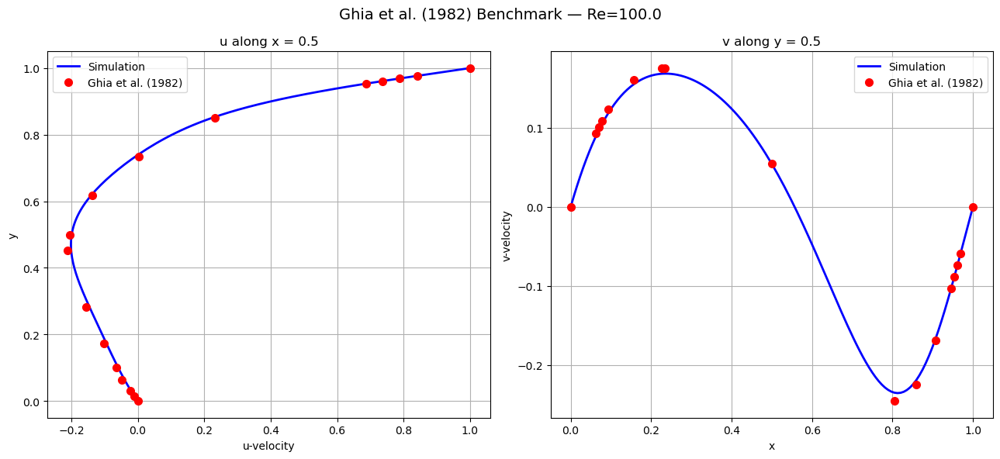

# CFD from Scratch — Foundations to Turbulence

A self-contained, notebook-based course in Computational Fluid Dynamics. Every concept is built from first principles in Python — no black-box solvers, no pre-packaged CFD libraries. You write the physics, the numerics, and the code yourself.

The course runs from the very first equation (what *is* a finite difference?) all the way to turbulence models used in industrial CFD codes like OpenFOAM and Fluent.

---

## About this repo

I built this while learning CFD myself — these notebooks are the notes and exercises I wrote as I worked through each concept from scratch. I'm still actively learning and adding to it.

I'm sharing it publicly so other self-learners can follow the same path without having to piece together resources from a dozen different places.

The entire course was built with the help of a [Claude Code](https://claude.ai/code) AI agent acting as an interactive CFD tutor — asking me questions before explaining, making me implement each concept before moving on, and catching my mistakes along the way. The Socratic + Feynman approach it follows is baked into how each notebook is structured.

**What the AI agent made vs. what I made:**

- `curriculum/` — curriculum notebooks and teaching notes written by the Claude Code agent. These contain theory, derivations, and worked examples.
- `exercise/` — **written entirely by me**. Every solver, every function, every line of code in this folder is my own implementation, written during the lesson after learning the concept. The agent only asked the questions; I wrote the code.

Think of it this way: the agent is the textbook and the professor, `exercise/` is my homework.

---

## Who this is for

- Engineers or scientists who want to understand what CFD solvers actually do inside
- Grad students preparing for research in fluid mechanics or numerical methods
- Anyone who has taken a fluids course but never implemented anything from scratch

**You need:** Python + NumPy comfort, basic calculus, some exposure to PDEs (the course builds intuition as it goes).

---

## What you will build

By the end of this course you will have implemented, from scratch:

| What | Key idea learned |
|------|-----------------|
| Finite difference schemes (1st–4th order) | Truncation error, order of accuracy |
| 1D linear advection (FTBS, FTCS, FTFS) | CFL condition, upwinding, numerical diffusion |
| 1D diffusion (explicit, implicit, Crank-Nicolson) | Stability vs accuracy, tridiagonal solvers |
| 1D Burgers' equation (inviscid + viscous) | Shock formation, characteristics, entropy condition |
| 2D scalar transport | Multi-dimensional upwinding, combined stability |
| Finite Volume Method | Flux balance, exact mass conservation |
| 2D Navier-Stokes solver | Pressure-velocity coupling, projection method |
| SIMPLE algorithm | Pressure correction, under-relaxation |
| Lid-driven cavity flow | Ghia et al. validation, iterative solvers |
| Flow over a cylinder | Drag, lift, vortex shedding |
| Boundary conditions | Dirichlet, Neumann, ghost cells |
| Turbulence: mixing-length model | RANS, Reynolds decomposition, Boussinesq hypothesis |
| Turbulence: k-ε and k-ω SST | Transport equations, blending functions, wall treatment |
| Mesh generation | Structured/unstructured/hybrid, y⁺ estimation, geometric clustering |

---

## Curriculum

---

### Module 1 — Foundations

**Reference notebooks** (written by the AI tutor):

| Notebook | Topic |
| -------- | ----- |
| [curriculum/module_01_foundations/01_what_is_cfd.ipynb](curriculum/module_01_foundations/01_what_is_cfd.ipynb) | What is CFD — discretization, grids, cost vs accuracy |
| [curriculum/module_01_foundations/02_python_for_cfd.ipynb](curriculum/module_01_foundations/02_python_for_cfd.ipynb) | Python and NumPy for CFD |
| [curriculum/module_01_foundations/03_conservation_laws.ipynb](curriculum/module_01_foundations/03_conservation_laws.ipynb) | Conservation laws — mass, momentum, energy |
| [curriculum/module_01_foundations/04_continuity_equation.ipynb](curriculum/module_01_foundations/04_continuity_equation.ipynb) | Continuity equation, incompressible flow |
| [curriculum/module_01_foundations/05_finite_difference_method.ipynb](curriculum/module_01_foundations/05_finite_difference_method.ipynb) | Finite difference schemes, order of accuracy, convergence |
| [curriculum/module_01_foundations/06_1d_linear_advection.ipynb](curriculum/module_01_foundations/06_1d_linear_advection.ipynb) | 1D linear advection — FTBS, CFL, upwinding, periodic BCs |
| [curriculum/module_01_foundations/07_1d_diffusion_equation.ipynb](curriculum/module_01_foundations/07_1d_diffusion_equation.ipynb) | 1D diffusion — explicit FTCS, implicit BTCS, Crank-Nicolson |
| [curriculum/module_01_foundations/08_1d_burgers_equation.ipynb](curriculum/module_01_foundations/08_1d_burgers_equation.ipynb) | Burgers' equation — shock formation, viscous vs inviscid |

**My exercises** (written by me):

- [exercise/1d_advection.ipynb](exercise/1d_advection.ipynb) — 1D linear advection, FTBS, CFL
- [exercise/1d_diffusion.ipynb](exercise/1d_diffusion.ipynb) — explicit and implicit diffusion schemes
- [exercise/1d_diffusion_with_ghost_cells.ipynb](exercise/1d_diffusion_with_ghost_cells.ipynb) — ghost cell boundary conditions
- [exercise/1d_inviscid_burgers_equation.ipynb](exercise/1d_inviscid_burgers_equation.ipynb) — inviscid Burgers, shock formation
- [exercise/1d_viscous_burgers_equation.ipynb](exercise/1d_viscous_burgers_equation.ipynb) — viscous Burgers, shock + diffusion

---

### Module 2 — Core CFD Methods

**Reference notebooks** (written by the AI tutor):

| Notebook | Topic |
| -------- | ----- |
| [curriculum/module_02_core_methods/01_2d_scalar_transport.ipynb](curriculum/module_02_core_methods/01_2d_scalar_transport.ipynb) | 2D advection-diffusion, multi-dimensional stability |
| [curriculum/module_02_core_methods/02_finite_volume_method.ipynb](curriculum/module_02_core_methods/02_finite_volume_method.ipynb) | Finite Volume Method — flux balance, mass conservation |
| [curriculum/module_02_core_methods/03_navier_stokes_equations.ipynb](curriculum/module_02_core_methods/03_navier_stokes_equations.ipynb) | Navier-Stokes equations — derivation, non-dimensionalization |
| [curriculum/module_02_core_methods/04_pressure_velocity_coupling.ipynb](curriculum/module_02_core_methods/04_pressure_velocity_coupling.ipynb) | Pressure-velocity coupling, projection method |
| [curriculum/module_02_core_methods/05_simple_algorithm.ipynb](curriculum/module_02_core_methods/05_simple_algorithm.ipynb) | SIMPLE algorithm — pressure correction, under-relaxation |
| [curriculum/module_02_core_methods/06_lid_driven_cavity.ipynb](curriculum/module_02_core_methods/06_lid_driven_cavity.ipynb) | Lid-driven cavity — theory and Ghia benchmark |
| [curriculum/module_02_core_methods/07_flow_over_cylinder.ipynb](curriculum/module_02_core_methods/07_flow_over_cylinder.ipynb) | Flow over a cylinder — drag, lift, vortex shedding |
| [curriculum/module_02_core_methods/08_boundary_conditions.ipynb](curriculum/module_02_core_methods/08_boundary_conditions.ipynb) | Dirichlet, Neumann, ghost cells |

**My exercises** (written by me):

- [exercise/2d_scalar_transport.ipynb](exercise/2d_scalar_transport.ipynb) — 2D advection-diffusion, multi-dimensional stability
- [exercise/fvm_1d_scalar.ipynb](exercise/fvm_1d_scalar.ipynb) — FVM flux balance, exact mass conservation
- [exercise/lid_driven_cavity.ipynb](exercise/lid_driven_cavity.ipynb) — full SIMPLE solver, Ghia et al. validated
- [exercise/cylinder_flow.ipynb](exercise/cylinder_flow.ipynb) — flow over a cylinder, drag and lift
- [exercise/flow_over_vertical_plate.ipynb](exercise/flow_over_vertical_plate.ipynb) — flow over a vertical plate
- [exercise/airfoil_flow.ipynb](exercise/airfoil_flow.ipynb) — airfoil flow simulation *(generated by the AI tutor as a demonstration; not independently written by me)*
- [exercise/airfoil_aoa_sweep_colab.ipynb](exercise/airfoil_aoa_sweep_colab.ipynb) — angle-of-attack sweep, Colab-ready *(generated by the AI tutor as a demonstration; not independently written by me)*

---

### Module 3 — Turbulence and Meshing

**Reference notebooks** (written by the AI tutor):

| Notebook | Topic |
| -------- | ----- |
| [curriculum/module_03_advanced/01_turbulence_basics.ipynb](curriculum/module_03_advanced/01_turbulence_basics.ipynb) | RANS, Reynolds decomposition, mixing-length, law of the wall |
| [curriculum/module_03_advanced/02_turbulence_models.ipynb](curriculum/module_03_advanced/02_turbulence_models.ipynb) | k-ε, k-ω SST, turbulent channel flow simulation |
| [curriculum/module_03_advanced/03_mesh_generation.ipynb](curriculum/module_03_advanced/03_mesh_generation.ipynb) | Mesh types — structured, unstructured, hybrid, y⁺ |
| [curriculum/module_03_advanced/04_higher_order_schemes.ipynb](curriculum/module_03_advanced/04_higher_order_schemes.ipynb) | Higher-order schemes — QUICK, ENO, WENO |
| [curriculum/module_03_advanced/05_multigrid_methods.ipynb](curriculum/module_03_advanced/05_multigrid_methods.ipynb) | Multigrid methods — V-cycle, smoothers |
| [curriculum/module_03_advanced/06_unsteady_flows.ipynb](curriculum/module_03_advanced/06_unsteady_flows.ipynb) | Unsteady flows — time accuracy, dual time-stepping |
| [curriculum/module_03_advanced/07_compressible_flow.ipynb](curriculum/module_03_advanced/07_compressible_flow.ipynb) | Compressible flow — shocks, Euler equations |
| [curriculum/module_03_advanced/08_pinns.ipynb](curriculum/module_03_advanced/08_pinns.ipynb) | Physics-Informed Neural Networks (PINNs) |

**My exercises** (written by me):

- [exercise/mesh_design.ipynb](exercise/mesh_design.ipynb) — y⁺ estimation, geometric clustering, tanh stretching

---

### Module 4 — Projects (coming)

| Notebook | Topic |
| -------- | ----- |
| [curriculum/module_04_projects/01_channel_flow.ipynb](curriculum/module_04_projects/01_channel_flow.ipynb) | Turbulent channel flow |
| [curriculum/module_04_projects/02_heat_exchanger.ipynb](curriculum/module_04_projects/02_heat_exchanger.ipynb) | Heat exchanger simulation |
| [curriculum/module_04_projects/03_airfoil_simulation.ipynb](curriculum/module_04_projects/03_airfoil_simulation.ipynb) | Airfoil aerodynamics |
| [curriculum/module_04_projects/04_turbulent_jet.ipynb](curriculum/module_04_projects/04_turbulent_jet.ipynb) | Turbulent jet |

---

## How to use this repo

**Recommended path:**

1. Read a reference notebook in `curriculum/` — these explain the theory.
2. Open the matching exercise notebook in `exercise/` and implement it yourself.
3. The exercise notebooks have the structure and comments; the implementation cells are yours to fill.

**Learning order:**

```
Module 1 (curriculum/module_01_foundations/) → Module 2 (curriculum/module_02_core_methods/) → Module 3 (curriculum/module_03_advanced/)
```

You can also jump to any topic if you already know the prerequisites.

---

## Setup

```bash
git clone https://github.com/harishragul/cfd.git
cd cfd
pip install numpy matplotlib scipy jupyter
jupyter notebook
```

No additional CFD libraries needed. Every solver is written in plain NumPy.

---

## Key concepts covered

**Numerical methods:** finite differences, finite volumes, explicit/implicit time integration, upwinding, Crank-Nicolson, Jacobi/Gauss-Seidel/SOR iterative solvers, Poisson equation

**Fluid mechanics:** conservation laws, incompressible Navier-Stokes, pressure-velocity coupling, projection method, SIMPLE algorithm, boundary layer theory, Reynolds decomposition

**Turbulence modeling:** mixing-length model, k-ε model, k-ω SST (Menter 1994), law of the wall, y⁺, turbulent channel flow

**Meshing:** structured/unstructured/hybrid meshes, skewness, aspect ratio, non-orthogonality, geometric and tanh clustering, y⁺ estimation workflow

---

## Validation

The lid-driven cavity solver is validated against the benchmark results of:

> Ghia, U., Ghia, K. N., & Shin, C. T. (1982). High-Re solutions for incompressible flow using the Navier-Stokes equations and a multigrid method. *Journal of Computational Physics*, 48(3), 387–411.



u-velocity along x = 0.5 and v-velocity along y = 0.5 at Re = 100, 41×41 grid. Red dots are Ghia et al. data; blue line is the solver output from [exercise/lid_driven_cavity.ipynb](exercise/lid_driven_cavity.ipynb).

---

## References

- Patankar, S. V. (1980). *Numerical Heat Transfer and Fluid Flow*. Hemisphere.
- Menter, F. R. (1994). Two-equation eddy-viscosity turbulence models for engineering applications. *AIAA Journal*, 32(8), 1598–1605.
- Barba, L. A., & Forsyth, G. F. (2018). CFD Python: the 12 steps to Navier-Stokes equations. *Journal of Open Source Education*, 2(16), 21.
- Ferziger, J. H., Perić, M., & Street, R. L. (2020). *Computational Methods for Fluid Dynamics* (4th ed.). Springer.

---

## License

MIT — use freely, attribution appreciated.
